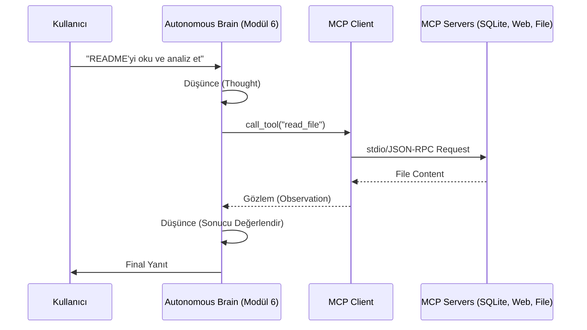

# 🌐 Otonom-Ağlar-MCP (Model Context Protocol)

<div align="center">
  
</div>
<br>

[](https://modelcontextprotocol.io)
[](https://www.python.org/)
[](#)
[](#)

> **Agentic AI Blueprint:** Büyük Dil Modellerini (LLM) dış dünyadan izole edilmiş birer "metin kutusu" olmaktan çıkarıp, otonom bir şekilde veri toplayan, karar alan ve sistemleri yöneten akıllı ajanlara dönüştürmek için profesyonel mimari rehberi.

---

## 🏗️ Mimari Ekosistem

MCP (Model Context Protocol), yapay zeka modelleri ile veri kaynakları arasında evrensel bir köprü kurar. Bu repoda uygulanan mimari şu şekildedir:



---

## 🗺️ Geliştirme Yol Haritası (Enhanced)

| Modül | Kapsam | Durum |
| :--- | :--- | :--- |
| **📗 Modül 1** | [Core Mechanics](src/01_core_mechanics) - JSON-RPC, Lifecycle | ✅ Tamamlandı |
| **📘 Modül 2** | [Local Interaction](src/02_local_servers) - SQLite, File System | ✅ Tamamlandı |
| **📙 Modül 3** | [Web Integrations](src/03_web_integrations) - Scraper, GitHub | ✅ Tamamlandı |
| **📕 Modül 4** | [Advanced Systems](src/04_advanced_agentic_systems) - Memory, Sandbox | ✅ Tamamlandı |
| **📓 Modül 5** | [Client Interface](src/05_mcp_client_example) - Programmatic Access | ✅ Tamamlandı |
| **👑 Modül 6** | [Autonomous Brain](src/06_llm_agent) - ReAct, Multi-Server | ✅ Tamamlandı |

---

## 🚀 Öne Çıkan Özellikler

*   **🧠 Gerçek ReAct Döngüsü:** Modül 6, Claude 3.5 Sonnet ile "Düşün-Eylem-Gözlem" döngüsünü otonom olarak yöneten sınıfyapısına sahiptir.
*   **🔗 Çoklu Sunucu Orkestrasyonu:** Tek bir ajan üzerinden aynı anda dosya sistemi, veritabanı ve web tarayıcı araçlarına erişim.
*   **🛡️ Güvenli Sandbox:** `secure_executor` ile dizin atlatma (path traversal) saldırılarına karşı korumalı dosya işlemleri.
*   **💾 Kalıcı Hafıza:** Ajanın görevler arası durum (state) saklayabilmesi için JSON tabanlı hafıza katmanı.

---

## 🛠️ Hızlı Başlangıç (Developer Guide)

```bash
# 1. Ortamı Hazırlayın
make dev

# 2. Testleri Çalıştırın
make test

# 3. Otonom Ajanı Başlatın
make run-llm
```

> [!IMPORTANT]
> **API Anahtarı**: Otonom beyin (Modül 6) için `.env` dosyanızda `ANTHROPIC_API_KEY` tanımlı olmalıdır.

---

## 📜 Lisans ve Katkı

Bu proje **MIT Lisansı** ile korunmaktadır. **Meta-Engineering Research Lab** bünyesinde, dijital dünyada otonomiyi inşa etmek gayesiyle tasarlanmıştır.

Lütfen katkıda bulunmadan önce projenin kök dizininde bulunan **CONTRIBUTING.md** ve **CODE_OF_CONDUCT.md** dosyalarını okuyun.

---

<div align="center">
  <b>Meta-Engineering Research Lab</b> bünyesinde, dijital dünyada otonomiyi inşa etmek gayesiyle <i>Dijital Seyyah</i> tarafından tasarlanmıştır. <br>
  (2026)
</div>