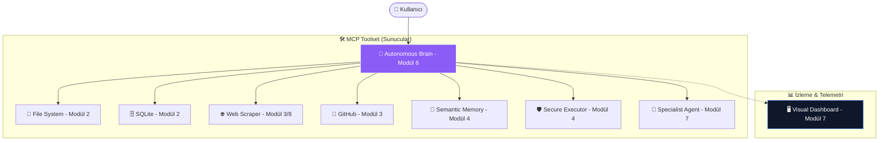

# 🌐 Otonom-Ağlar-MCP (Model Context Protocol)

<div align="center">
  
</div>
<br>

[](https://modelcontextprotocol.io)
[](https://www.python.org/)
[](#)
[](#)

> **Agentic AI Blueprint:** Büyük Dil Modellerini (LLM) dış dünyadan izole edilmiş birer "metin kutusu" olmaktan çıkarıp, otonom bir şekilde veri toplayan, karar alan ve sistemleri yöneten akıllı ajanlara dönüştürmek için profesyonel mimari rehberi.

---

## 🚀 Vizyon ve Felsefe: Agentic Engineering

Modern yapay zeka artık sadece "cevap vermek" ile yetinmiyor; artık **aksiyon alıyor**. **Otonom-Ağlar-MCP**, basit bir kütüphane değil, modellerin gerçek dünya ile (dosya sistemleri, veritabanları, web tarayıcılar ve diğer ajanlar) nasıl güvenli ve otonom bir şekilde etkileşime gireceğini gösteren uçtan uca bir laboratuvardır.

Bu repo, Anthropic'in **Model Context Protocol (MCP)** standardını kullanarak, bir yapay zekanın "Eyleme Geçme" (Action-Oriented) yeteneklerini en üst seviyeye taşır.

---

## 🏗️ Mimari Ekosistem ve Topoloji

Proje, 8 modülden oluşan devasa bir **Ajan Ağı (Agent Network)** topolojisine sahiptir. Master Brain (Ajanın Beyni), bu ağdaki sunucuları tıpkı bir orkestra şefi gibi yönetir.



---

## 🗺️ Geliştirme Yol Haritası ve Modül Detayları

| Modül | Kapsam | Teknik Detay |
| :--- | :--- | :--- |
| **📗 Modül 1** | **Core Mechanics** | JSON-RPC protokolü, yaşam döngüsü yönetimi ve `FastMCP` temelleri. |
| **📘 Modül 2** | **Local Interaction** | SQLite veritabanı sorgulama ve güvenli dosya okuma/yazma araçları. |
| **📙 Modül 3** | **Web & API** | GitHub Issue yönetimi ve Playwright tabanlı dinamik web rendering. |
| **📕 Modül 4** | **Advanced Systems** | `Sentence-Transformers` tabanlı semantik hafıza ve RAG (Retrieval-Augmented Generation). |
| **📓 Modül 5** | **Client Interface** | Sunucuları programatik olarak kontrol eden özel MCP Host implementasyonu. |
| **👑 Modül 6** | **Autonomous Brain** | Anthropic ReAct (Thought-Action-Observation) otonom döngüsü. |
| **🖥️ Modül 7** | **Visual Dashboard** | Flask & Socket.io ile ajanın düşünce zincirini anlık izleyen GUI. |
| **🏗️ Modül 8** | **Autonomous Architect** | Kendi kendine dosya yapısı kuran ve hataları düzelten 'Engineer' ajanı. |

---

## 🌟 Öne Çıkan Mühendislik Desenleri

### 1. ReAct (Reason-Act) Döngüsü
Ajan, kendisine verilen görevi parçalara böler. Her adımda:
- **Thought (Düşünce):** Mevcut durumu analiz eder.
- **Action (Eylem):** MCP araçlarından birini seçer (örn: `search_knowledge`).
- **Observation (Gözlem):** Aracın döndüğü sonucu değerlendirip bir sonraki adıma geçer.

### 2. Semantik Hafıza (Vector RAG)
Modül 4, ajanın geçmişteki tüm etkileşimlerini bir vektör veritabanında (`semantic_memory.json`) saklar. Bir soru sorulduğunda, ajan sadece kelime eşlemesi yapmaz, **anlamsal benzerlik** kurarak en alakalı anılarını hatırlar.

### 3. Recursive Delegation (Ajan-Ajan İletişimi)
Beyin, bir dosyada karmaşık bir hata bulduğunda, bu işi Modül 7'deki **"Uzman Kod Analisti"** alt-ajanına devreder. Bu, dünyadaki ilk "Recursive MCP" örneklerinden biridir.

---

## 🛠️ Kurulum ve Monitorizasyon

### Hızlı Başlangıç
```bash
# 1. Bağımlılıkları Yükle ve Sistemi Kontrol Et
make dev

# 2. Tarayıcıları Hazırla (Playwright)
playwright install chromium

# 3. Görsel Dashboard'u Başlat
make dashboard
```

### Otonom Görev Başlatma
Yeni bir terminalde:
```bash
make run-llm
```

> [!IMPORTANT]
> **API Konfigürasyonu**: Kök dizinde bir `.env` dosyası oluşturun ve şu değişkenleri tanımlayın:
> - `ANTHROPIC_API_KEY`: Ajanın beyni için.
> - `GITHUB_TOKEN`: GitHub araçları için.

---

## 🛡️ Güvenlik ve Sandbox Paradigması

Otonom ajanlar "yazma" yetkisine sahip olduğu için, sistemimizde **Strict Directory Validation** protokolü uygulanır. `secure_executor.py` sayesinde ajan, sizin belirttiğiniz `MCP_SANDBOX_DIR` dışına asla çıkamaz ve sistem dosyalarınıza zarar veremez.

---

## 📜 Lisans ve Katkı

Bu proje **MIT Lisansı** ile korunmaktadır. **Meta-Engineering Research Lab** bünyesinde, dijital dünyada otonomiyi inşa etmek gayesiyle tasarlanmıştır.

Lütfen katkıda bulunmadan önce projenin kök dizininde bulunan **CONTRIBUTING.md** ve **CODE_OF_CONDUCT.md** dosyalarını okuyun.

---

<div align="center">
  <b>Meta-Engineering Research Lab</b> bünyesinde, dijital dünyada otonomiyi inşa etmek gayesiyle <i>Dijital Seyyah</i> tarafından tasarlanmıştır. <br>
  (2026)
</div>